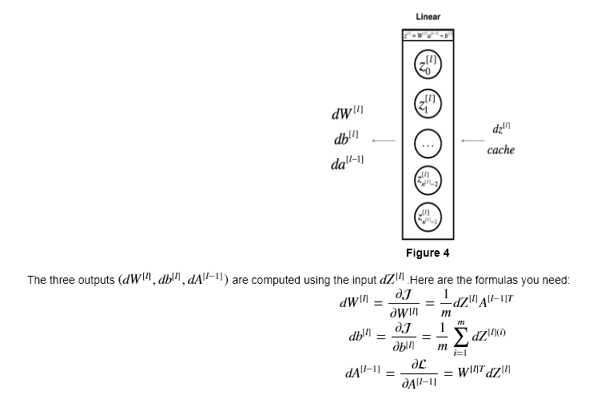

# Neural Networks and Deep Learning

- [1. Introduction to Deep Learning](#1-introduction-to-deep-learning)
  - [1.1. A. What is a neural network?](#11-a-what-is-a-neural-network)
  - [1.2. B. Why is Deep Learning taking off?](#12-b-why-is-deep-learning-taking-off)
- [2. Neural Networks Basics](#2-neural-networks-basics)
  - [2.1. A. Binary classification (Logistic regression)](#21-a-binary-classification-logistic-regression)
    - [2.1.1. Loss function](#211-loss-function)
    - [2.1.2. Gradient descent](#212-gradient-descent)
- [3. Shallow neural networks](#3-shallow-neural-networks)
  - [3.1. A. Neural network representation](#31-a-neural-network-representation)
  - [3.2. B. Activation functions](#32-b-activation-functions)
  - [3.3. C. Derivative of activation functions](#33-c-derivative-of-activation-functions)
  - [3.4. D.Initialization](#34-dinitialization)
  - [3.5. Recap](#35-recap)
- [4. Deep Neural Networks](#4-deep-neural-networks)
  - [4.1. A. Forward propagation](#41-a-forward-propagation)
  - [4.2. B. Backpropagation](#42-b-backpropagation)
  - [4.3. C. Hyperparameters](#43-c-hyperparameters)

## 1. Introduction to Deep Learning

### 1.1. A. What is a neural network?

Neuron : max(0, linear function of input) -> Rectified Linear Unit (ReLU)

Mostly used today for Supervised Learning. Some examples:

* online ads (std NN)
* photo tagging (CNN)
* speech recognition (RNN)
* autonomous driving (RNN+)
* machine translation (Hybrid)

Applicable to both structured and unstructured data

### 1.2. B. Why is Deep Learning taking off?

Benefit of large data set (with larger NN): *scale* drives DL progress

Small training sets is more dependent on feature engineering and selection than on algorithm/models.

Computation power improves

Algorithm breakthrough (also often improving computation efficiency): e.g. using ReLU instead of Sigmoid

Both allows for more iterative work

## 2. Neural Networks Basics

### 2.1. A. Binary classification (Logistic regression)

Can be seen a simple one neuron neural network

#### 2.1.1. Loss function

Not using squared error because the problem would become non convex.

Loss function on a single sample vs cost function on the entire set.

* Loss function: 
* Cost function:  ( this comes from taking the log of the product of the probabilities that tranforms into the sum of probabilities)

#### 2.1.2. Gradient descent

Objective: find w,b that minimizes or cost function (which is convex)

Repeat:
w := w - alpha * dJ(w, b)/dw
b := b - alpha * dJ(w, b)/db

with alpha being the learning rate

To compute over m examples: dJ/dw = 1/m * sum_i dL(a^i, y^i)/dw^i

In deep learning, we usually recommend that you:

* Choose the learning rate that better minimizes the cost function.
* If your model overfits, use other techniques to reduce overfitting. 

## 3. Shallow neural networks

Only a few neurons/layers

### 3.1. A. Neural network representation

When counting the layers for a NN we don't count the input layer

### 3.2. B. Activation functions

Sigmoid function
Hyperbolic tangent function: usually performs better than sigmoid. Acts similarly to centering the data on zero (except for the output layer ofc).
Rectified Linear Unit: performs better with large values

Sigmoid can be used for output layer if binary outcome

ReLU usually the default

Inconvenient with ReLU: gradient is zero when values are negative. One can then use leaky ReLU.

Linear function can only be used for output for a regression for example (ReLU could also be used if R+)

### 3.3. C. Derivative of activation functions

Sigmoid dg = g(1-g)
Tanh  dg/dz = 1-g(z)**2 (so if z = tanh(a) we end up with dg/dz = 1-tanh(z)**2=1-tanh(tanh(a))**2)
ReLu: 0, if x<0, 1 if x>=0 (note that it is technically not defined at 0)

### 3.4. D.Initialization

If you initialize to zero, all the network will be symmetric (basically each neuron have the same influence from start, and each neuron of first layer will compute exactly the same thing and so on)

Symmetry breaking problem solution:random init of weights with small wiehgt (if too large you slow down your learning if using sigmoid/tanh)

### 3.5. Recap

## 4. Deep Neural Networks

Limit between shallow and deep is not hard coded. Usually deep refers to ore than one hidden layers.

### 4.1. A. Forward propagation

Straightforward from the shallow network. For loop is required to iterate over layer. Cache is used to store activation and linear result used for backpropagation.

### 4.2. B. Backpropagation

Goal: Compute db and dW to update the parameters accordingly.

Requires: 
* dZ: dA * g'(Z)
  * dA: from cache ( W(l+1)*dZ(l+1) )
  * Z: from cache
* A[l-1]: from cache

Initialize: 
* dZ[L]: dA[L] * g[L]'(Z[L]): dA[L] = Y/A[L] - (1-Y, 1-A[L]) (derived from A[L] = g(Z[L])), with g=sigmoid.

### 4.3. C. Hyperparameters

* learning rate
* iteration
* hidden layers
* hidden units
* activation functions

But also:

* momentum
* mini-batch size
* regulations

Applied DL is still highly empirical.
