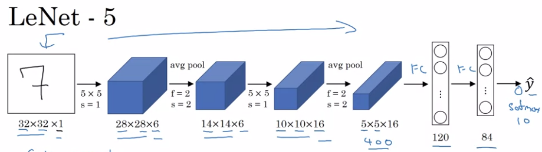
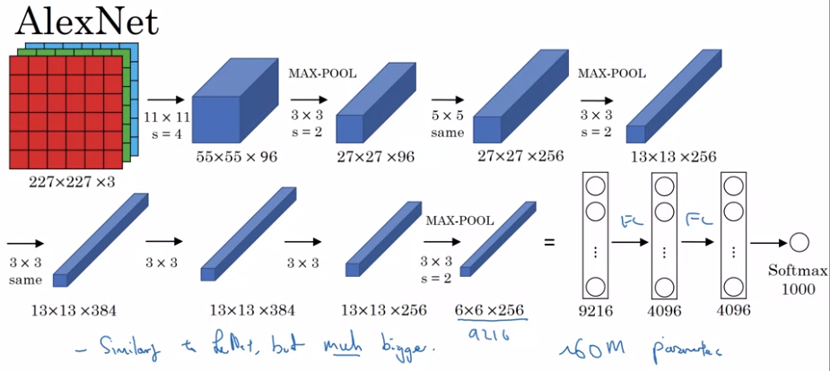
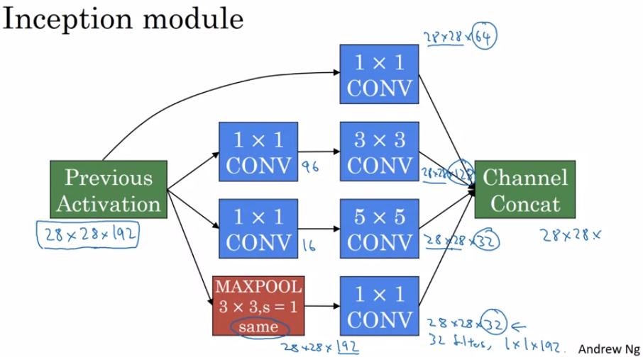

- [1. Convolutional Neural Networks](#1-convolutional-neural-networks)
  - [1.1. Week 1 - Computer Vision](#11-week-1---computer-vision)
    - [1.1.1. Idea](#111-idea)
    - [1.1.2. Padding](#112-padding)
    - [1.1.3. Strided convolution](#113-strided-convolution)
    - [1.1.4. Convolutions over volume](#114-convolutions-over-volume)
    - [1.1.5. Multiple filters](#115-multiple-filters)
    - [1.1.6. One layer of CNN](#116-one-layer-of-cnn)
    - [1.1.7. Pooling layers (POOL)](#117-pooling-layers-pool)
    - [1.1.8. Full CNN overview](#118-full-cnn-overview)
  - [1.2. Week 2 - Case studies](#12-week-2---case-studies)
    - [1.2.1. Classic networks](#121-classic-networks)
      - [1.2.1.1. LeNet - 5](#1211-lenet---5)
      - [1.2.1.2. AlexNet](#1212-alexnet)
      - [1.2.1.3. VGG-16](#1213-vgg-16)
    - [1.2.2. ResNets](#122-resnets)
    - [1.2.3. Inception network](#123-inception-network)
    - [1.2.4. Transfer learning](#124-transfer-learning)
    - [1.2.5. Data augmentation](#125-data-augmentation)
  - [1.3. Week 3 - Landmark Detection](#13-week-3---landmark-detection)
    - [1.3.1. How to define the Y?](#131-how-to-define-the-y)
    - [1.3.2. Landmark detection](#132-landmark-detection)
    - [1.3.3. Object detection: Sliding window](#133-object-detection-sliding-window)
    - [1.3.4. Convolutional implementation of sliding windows to solve computational issues](#134-convolutional-implementation-of-sliding-windows-to-solve-computational-issues)
    - [1.3.5. YOLO algorithm](#135-yolo-algorithm)
      - [1.3.5.1. Bounding Box Predictions](#1351-bounding-box-predictions)
      - [1.3.5.2. Intersection over Union (IoU)](#1352-intersection-over-union-iou)
      - [1.3.5.3. Non-max suppression](#1353-non-max-suppression)
      - [1.3.5.4. Anchor boxes: overlapping objects](#1354-anchor-boxes-overlapping-objects)
    - [1.3.6. Regional-CNN](#136-regional-cnn)
  - [1.4. Week 4: Facial recognition](#14-week-4-facial-recognition)
    - [1.4.1. Face recognition](#141-face-recognition)
      - [1.4.1.1. Face verification vs face recognition](#1411-face-verification-vs-face-recognition)
      - [1.4.1.2. One shot learning](#1412-one-shot-learning)
      - [1.4.1.3. Siamese network](#1413-siamese-network)
      - [1.4.1.4. Triplet Loss](#1414-triplet-loss)
      - [1.4.1.5. Face verification and binary classification](#1415-face-verification-and-binary-classification)
    - [1.4.2. Neural style transfer](#142-neural-style-transfer)
      - [1.4.2.1. Cost function](#1421-cost-function)

# 1. Convolutional Neural Networks

## 1.1. Week 1 - Computer Vision

### 1.1.1. Idea

The large dimension of the input space when using images requires new algorithms.

Convolute the matrix with a specific filter to detect features.

The idea behind CNN is to treat the filter as parameters to learn.

Technically what is usually called convolution in DL is a cross-correlation.

### 1.1.2. Padding

(n*n) matrix convoluted with a (f*f) matrix gives a (n-f+1, n-f+1)

Two issues:

* shrinks the image
* throw away information from the edge

Pad the image with p leading to: (n+p*n+p) matrix convoluted with a (f*f) matrix gives a (n+p-f+1, n+p-f+1).  With n=6, f=4, p=1, your end result would be (6,6).

**Valid convolutions**: no padding
**Same convolutions**: padding to keep the same input size for output size (p=(f-1)/2)

Usually f is an odd number:

* issue with padding
* allow for a central pixel

### 1.1.3. Strided convolution

Isntead of moving the filter by 1 step, you move it by a specific stride

(n,n) conv (f, f), with padding p and stride s, floor of ( (n+2p-f)/s +1, (n+2p-f)/s +1 )

### 1.1.4. Convolutions over volume

Image: heigth*width*#channels (=depth)

Filter has the same number of channels

### 1.1.5. Multiple filters

Stack the output of convolution with each other (similarly to adding channels).

### 1.1.6. One layer of CNN

1. Convolution between input and filters (similar to W*A)
2. Add bias (similar to + B)
3. Activation function (similar to relu(WA+B)) -> also stacks together the output of the different filters

**Number of parameters:** 10 filters, (3,3,3) -> (3*3*3+1)*10=280

Note that it doesn't not depends on the input feature space dimension

**Notations**
* filter size: 
* padding: 
* stride: 
* inputdimensino: 
* output dimension: 
* filter dimension: 
* activations: 
* weights dimension: 
* bias dimension: 

### 1.1.7. Pooling layers (POOL)

* Max pooling: apply a filter taking the max of the values. 
* Average pooling: apply a filter taking the average of the values. 

Hyperparameters:

* filter size
* stride
* usually no padding
Note that there is no parameters to learn during backpropagation.

Can be applied independently on each channel if multiple channels.

### 1.1.8. Full CNN overview

Usually one CONV+POOL is considered as 1 layer (especially since POOL has no parameters t be learned)

For the output of the CNN, consolidate the last POOL output into one vector and add fully connected layer (FC)

## 1.2. Week 2 - Case studies

### 1.2.1. Classic networks
#### 1.2.1.1. LeNet - 5

Simple network, we would use MAX pooling instead now and ReLu.

[Gradient-Based Learning Applied to Document Recognition](http://yann.lecun.com/exdb/publis/pdf/lecun-01a.pdf)

#### 1.2.1.2. AlexNet

Similar to LeNet but much bigger and use ReLu

[ImageNet Classification with Deep Convolutional Neural Networks](https://papers.nips.cc/paper/4824-imagenet-classification-with-deep-convolutional-neural-networks.pdf)

#### 1.2.1.3. VGG-16

Simple layers with regular parameters but huge network.

[ImageNet Classification with Deep Convolutional Neural Networks](https://arxiv.org/pdf/1409.1556.pdf)

### 1.2.2. ResNets

[ImageNet Classification with Deep Convolutional Neural Networks](https://arxiv.org/pdf/1512.03385.pdf)

### 1.2.3. Inception network

1x1 convolution layer allows to decrease or keep the same number of channels.

[Going Deeper with Convolutions](https://arxiv.org/pdf/1409.4842.pdf)

Apply multiple layers after one layer and stack them together/

Issue: computation cost -> use 1x1 conv to reduce number of channels

**Inception module**

**Inception network**

Multiple inception modules, with intermediate output branch with softmax to ensure that even intermediate layers are learning, and additional max pool layers to adapt layer size.

### 1.2.4. Transfer learning

You save the internal layer to disk and remove the last layers. You can chose where to put the line between what you keep and what you will retrain.

Also possible to use it only as a weight initialization.

### 1.2.5. Data augmentation

Stay careful not to overfit your data.

Image augmentation:

* PCA color augmentation
* Color shift
* Rotation
* Flip
* Crop

Implementation remarks:

* Have different threads doing the distorsions and training when you cannot store the augmented data

## 1.3. Week 3 - Landmark Detection

* Image classification: classify image
* Image classification with localization: same but with object localization (b_x, b_y, b_h, b_w)
* Object Detection: Same but with multiple objects on an image

### 1.3.1. How to define the Y?

Y =(p_c, b_x, b_y, b_h, b_w, c_1, c_2, cn)

* p_c: 0, or 1 if object detected
* c_i: 1 if class identified

Loss(p_c=1)=regular loss on all y component
Loss(p_c=0)=loss only on p_c

### 1.3.2. Landmark detection

Add # of l_x, l_y countouring the landmark.

The order of landmarks is important.

### 1.3.3. Object detection: Sliding window

Take a window and crop the image, sliding it progressively through the whole image. Repeat with increased window size.

*Disadvantage*: lots and lots of repetition impact computation power

### 1.3.4. Convolutional implementation of sliding windows to solve computational issues

[OverFeat: Integrated Recognition, Localization and Detection using Convolutional Networks](https://arxiv.org/pdf/1312.6229.pdf)

Replace fully connected layers by convolutional layers: n_filters = # of cells in FC layer, filter_size = size of input volume.

Last softmax layer can be replaced by a 1*n*n_classes

**For sliding windows**

The max-pool following the convolutional layer acts similarly to a sliding window with a stride=size_of_max_pool layer

*Note* that it does not provide specific coordinates (default to sliding window coordinate)

### 1.3.5. YOLO algorithm

#### 1.3.5.1. Bounding Box Predictions

[You Only Look Once: Unified, Real-Time Object Detection](https://arxiv.org/pdf/1506.02640.pdf)

Apply a grid over the image (say 3*3) and apply the convnet over each of this cell with and output that includes coordinates (b_x, b_çy, b_h, b_w).

*Note* on coordinate: Coordinates are relative to top-left corner of each grid cell and are real number €[0, 1], however b_w and b_h could be larger than 1.

#### 1.3.5.2. Intersection over Union (IoU)

IoU = size of intersection / size of union ; Usually *correct* if IoU >= 0.5.

With union being the union  predicted and true regions and intersect their intersection.

#### 1.3.5.3. Non-max suppression

Make sure to detect once object only once when using YOLO.

Keep the region with highest probability, and remove the other ones with high IoU.

Algorithm:

* Discard all cell with a p_c <= threshold (0.6 for instance)
* While there are remaning cells
  * Pick the cell with highest p_c
  * Remove all other with IoU >= threshold (0.5 for instance)

#### 1.3.5.4. Anchor boxes: overlapping objects

Predefine anchor box=shape of box, and change your output to be usual output*#anchor boxes.

Assign each object to a grid and anchor with highest IoU.

In practice it is more useful for the algorithm to be more specialized than to account for overlapping objects.

To select the number of anchor box, you can use k-means to automate it (c.f. next yolo paper)

### 1.3.6. Regional-CNN

Apply a segmentional algorithm to try identify region of intereset where to apply the CNN.

*Quite slow* -> Fast R-CNN: use convolution implementation. -> Faster R-CNN: use convolutional network to propose regions

## 1.4. Week 4: Facial recognition

### 1.4.1. Face recognition

#### 1.4.1.1. Face verification vs face recognition

* verification: 1 to 1 problem. 
* recognition: 1 to K problem -> more susceptible to errors

#### 1.4.1.2. One shot learning

Having seen only one time each person, the NN has to learn features to allow face recognition.

Instead learn a similarity function that output the degree of difference between images.

#### 1.4.1.3. Siamese network

Calculate the difference between the output of the same NN with different inputs.

Then you want to learn parameters that maximize the distance of output between two different inputs.

#### 1.4.1.4. Triplet Loss

[FaceNet: A Unified Embedding for Face Recognition and Clustering](https://arxiv.org/pdf/1503.03832)

**Learning Objective**

* Anchor image (A)
* Positive image (P)
* Negative image (N)

Want: ||f(A)-f(P)||² - ||f(A)-f(N)||² <<< 0 (or < alpha (margin)).

Given (A, P, N):

 and thus over the whole training set 
 
 

You would need several images for each person (~10).

**Chosing the triplets A, P, N**

If chosen randomly, very easy to satisfy the cost function.

#### 1.4.1.5. Face verification and binary classification

Alternative to triplet loss: input is two output of a CNN network, into a single cell. Several methods to calculate the difference between the two images.

Training set: duos of images with either similar or different and labels as 1 or 0.

### 1.4.2. Neural style transfer

Generate an image (G) from some content (C) and some style (S)

#### 1.4.2.1. Cost function

Two cost function to compare the generated G to both C and S.

Initiate the G randomly and the GD to minimize the cost function.

**Content Cost Function**: Similarity between the activation of the hidden layers of the networks
**Style Cost Function**: Squared difference between the two Gram matrices (correlation between the activation across channels of the hidden layers of the networks) --> summed over the layers with an additional lambda parameters for each layer to weight the cost of each layer.
