# Sequence Models

- [1. Recurrent Neural Networks](#1-recurrent-neural-networks)
  - [1.1. Notations](#11-notations)
  - [1.2. Recurrent Neural Network Model](#12-recurrent-neural-network-model)
  - [1.3. Language model and sequence generation](#13-language-model-and-sequence-generation)
  - [1.4. Vanishing gradients with RNNs and solutions](#14-vanishing-gradients-with-rnns-and-solutions)
    - [1.4.1. Gated Recurrent Unit (GRU)](#141-gated-recurrent-unit-gru)
    - [1.4.2. Long Short Term Memory (LSTM)](#142-long-short-term-memory-lstm)
  - [1.5. Bidirectional RNN](#15-bidirectional-rnn)
  - [1.6. Deep RNN](#16-deep-rnn)
- [2. Natural Language Processing](#2-natural-language-processing)
  - [2.1. Word embeddings](#21-word-embeddings)
  - [2.2. Word2vec & GloVe](#22-word2vec--glove)
    - [2.2.1. Skip-grams model](#221-skip-grams-model)
    - [2.2.2. Negative sampling](#222-negative-sampling)
    - [2.2.3. GloVe word vectors](#223-glove-word-vectors)
  - [2.3. Application of word embeddings](#23-application-of-word-embeddings)
    - [2.3.1. Simple sentiment classification model](#231-simple-sentiment-classification-model)
    - [2.3.2. RNN for sentiment classification](#232-rnn-for-sentiment-classification)
    - [2.3.3. Debiasing word embeddings](#233-debiasing-word-embeddings)
- [3. Sequence models & Attention mechanism](#3-sequence-models--attention-mechanism)
  - [3.1. Various sequence to sequence architectures](#31-various-sequence-to-sequence-architectures)
    - [3.1.1. Basic models](#311-basic-models)
    - [3.1.2. Beam search](#312-beam-search)
      - [3.1.2.1. Beam search algorithm](#3121-beam-search-algorithm)
      - [3.1.2.2. Length normalization](#3122-length-normalization)
      - [3.1.2.3. Error analysis in beam search](#3123-error-analysis-in-beam-search)
    - [3.1.3. Bleu Score (BiLangual Evaluation Understudy)](#313-bleu-score-bilangual-evaluation-understudy)
    - [3.1.4. Attention Model](#314-attention-model)
  - [3.2. Audio Data](#32-audio-data)
    - [3.2.1. Speech recognition](#321-speech-recognition)
    - [3.2.2. Trigger Word Detection](#322-trigger-word-detection)

##  1. Recurrent Neural Networks

### 1.1. Notations

**Example**

*x*: "Harry Potter and Hermione Grander invented a new spell"
represented as x^<1> x^<2> etc. T_x = 9 (length)

*y*: 1 1 0 1 1 0 0 0 0
represented as y^<1> y^<2> etc. T_y = 9 (length)

 Generalized as X^(i)<t> and T_X^(i), where t is the t^th element in the i^th example.

 **Representing words**: Use a vocabulary vector V of words that you can then use to referenced words with x^<t> be a one-hot representation (1 at position of the word in V and 0 elsewhere)

### 1.2. Recurrent Neural Network Model

**Why not a  standard network**
* Inputs and outputs can be of different lengths through different examples
* Does not share features learned across different positions of text: Same word at different position will be treated as completly different
* Input size would very large (max number of words of sentence * size of vocabulary)

**Recurrrent Neural Networks**

Use the activation from the previous steps. Same parameters are used (W_ax, W_ya, W_aa)
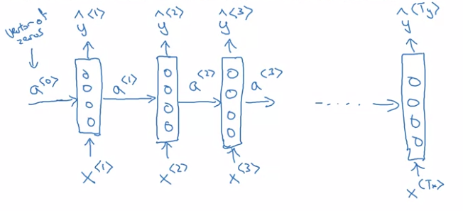

*Limitation*: only takes into account past X and not following (c.f. Bidirectional RNN).

**Forward Propagation**

*Internal activation functions*: usually tanh, can be ReLU
*Output activation functions*: depends on the type of output (sigmoid, softmax)

}=g(w_{aa}a^{<t-1>}+W_{ax}x^{<t>}+b_a">

that can be simplified by merging horizontally W matrices and vertically a and X matrices

}=g(w_{a}[a^{<t-1>}, x^{<t>}]+b_a">

and

}=g(w_{ya}a^{<t>}+b_y">

where W_ya can be written W_y to simplify the notation.

**Backpropagation through time**

**Loss function** 

}(\hat{y}^{<t>}, y^{<t>})=-y^{<t>}log(\hat{y}^{<t>})-(1-y^{<t>})log(1-\hat{y}^{<t>})">

And overall loss function

}(\hat{y}^{<t>}, y^{<t>})">

**Different types of RNNs - Input and output of different lengths**

* Many-to-One: Notation of reviews
* One-to-Many: Music generation
* Many-to-Many with different input and output lengths: translation

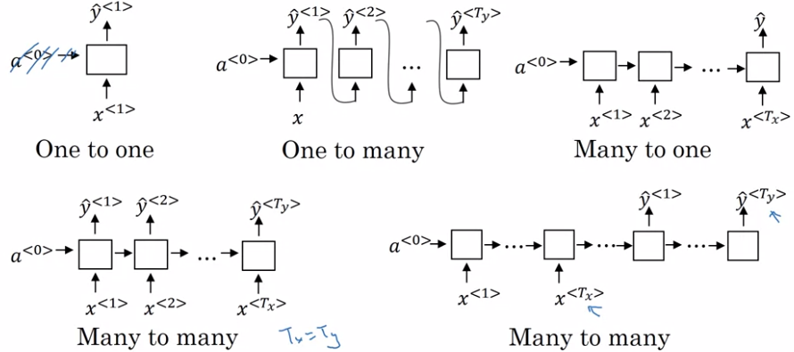

### 1.3. Language model and sequence generation

Training on a corpus to try to predict the following word based on previous words.

This can be used later by sampling a word at each step to generate new sequences of words.

### 1.4. Vanishing gradients with RNNs and solutions

Basic RNNs are not very good at capturing long term-dependencies, similar to deep NN where backpropagation has difficulties to impact on earlier weights.

Similarly, exploding gradients can occur, but is easier to spot and happens fewer times. Simple solution is to apply gradient clipping.

#### 1.4.1. Gated Recurrent Unit (GRU)

We can add a memory cell C, which will take the same value as the activation, that can be updated by a candidate value:

}=tanh(W_c[c^{<t-1>},x^{<t>}]%2bb_c)">

Let's define "Gate Update":

},x^{<t>}]%2bb_u">

That will "decide" when we update c:

 }=\Gamma_u*\tilde{c}^{<t>}%2b(1-\Gamma_u)*c^{<t-1>}">

 This overall helps to maintain weights "as-is".

 The complete GRU adds "relevant" Gate to compute the new candidate.

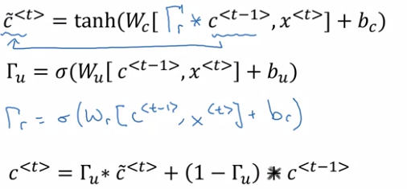

#### 1.4.2. Long Short Term Memory (LSTM)

More generalized version of the GRU, where:
*  activation and memory cell are not equal anymore.
*  we use a forget gate Gamma_f in addition to the update gate Gamma_u to compute c
*  we add an output gate to compute the final activation

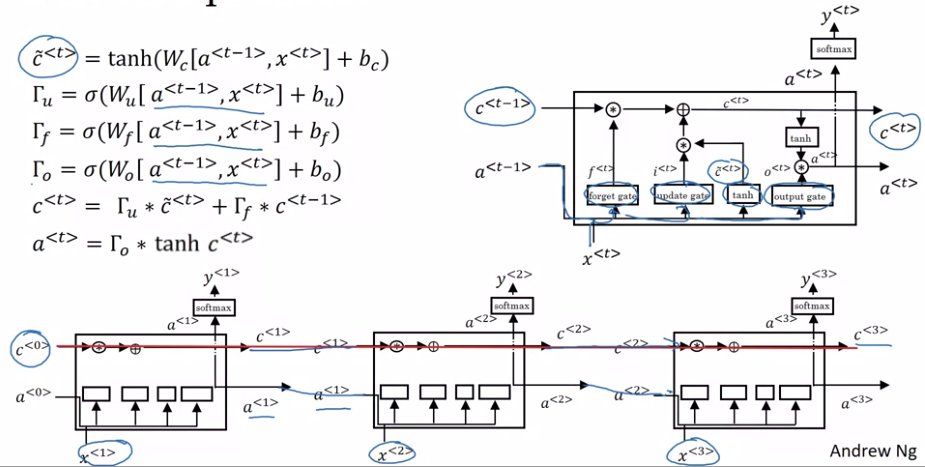

The red line show how it can be quite easy for the network to forward to the right the initial c_0 value.

Another variation called "peephole" where we use c_t-1 to compute the gates value instead of x.

Overall although LSTM is more powerful, it can be interesting to try GRU since it allows to build very complex network more easily.

### 1.5. Bidirectional RNN

We double the initial RNN with a forward propagation starting from the end and moving to the left.

This can be coupled with GRU/LSTM approach where each neuron is a GRU or LSTM cell.

**N.B.** One issue is that you need the entire sequence before you can make a prediction (issues with speech recognition for instance).

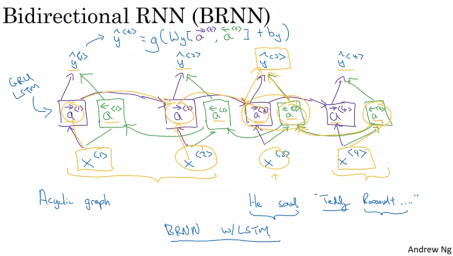

### 1.6. Deep RNN

We can stack multiple layers of RNN, however networks won't be as deep as regular NN since it would then become too computationally expensive.

## 2. Natural Language Processing

### 2.1. Word embeddings

1-hot representation: O_123 would be One-hot vector representing the 123th word -> difficult to represent similarities between words, since all vector are orthogonal.

Word embeddding: represent word as vector of features.

| .  | Man | Woman | Apple | Queen |
|----|     |      |        |     |
|Fruit|0.001|0.1|0.9|0.92|
|Gender|-1|1|0.0|0.95|

etc.

With this representation, words expressing similar things will be closer to one another.

To visualize these word embeddings, one popular algorithm is t-SNE to visualize feature vectors on a 2D plane.

**Practical use of word embeddings**

1. Learn word embeddings from large text corpus (or download pre-trained)
2. Use transfer learning for a new task with labeled training set
3. Finetune the word embeddings with new data

Very useful when you have a large unlabelled data set and and a smaller labelled data set.

**Analogies**

By substracting two vectors and comparing it to other differences between two vectors you can identify the main feature that is different between vectors, and find others vectors with similar differences.

Most often used similarity function: cosine similarity

**Embedding matrix**

### 2.2. Word2vec & GloVe

#### 2.2.1. Skip-grams model

Target is a word at random position close to the chosen context word.

Efficient at learning embedding words.

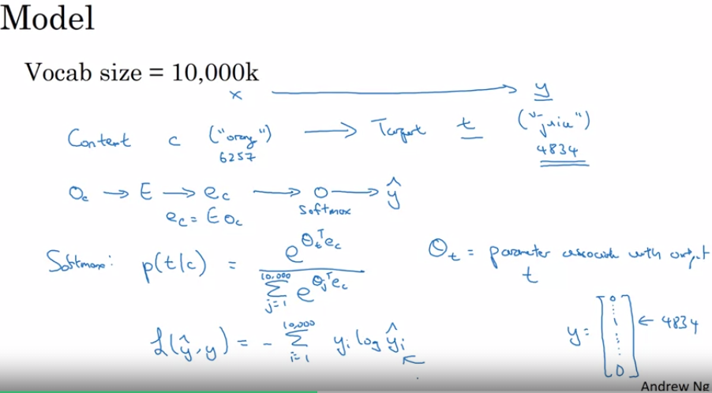

**Problems with softmax classificcation**

Computationally expensive (sum over the whole vocabulary matrix )

Solution is to use hierarchical softmax ~binary tree, where you can put less often used words at the bottom.

**Sampling context C**

We don't want only very often words to appear in this sampling, so we need to chose other heuristics.

#### 2.2.2. Negative sampling

New learning problem: take a context word and target word, and set target=1. Additionally take k (5-20 for small dataset, 2-5 for larger dataset) random words from dictionary with target=0.

Best sampling method according to paper: 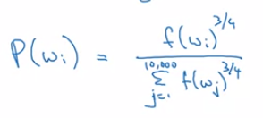

New model: logistic regression model 

, with:

* c: context word
* t: target word
* y: 0 if target word is not the one, 1 elsewhere

This leads to training only k+1 classification regressor on each iterations instead of V (size of vocabulary).

#### 2.2.3. GloVe word vectors

X_ij = number of time j (target) appears in context of i (context). 

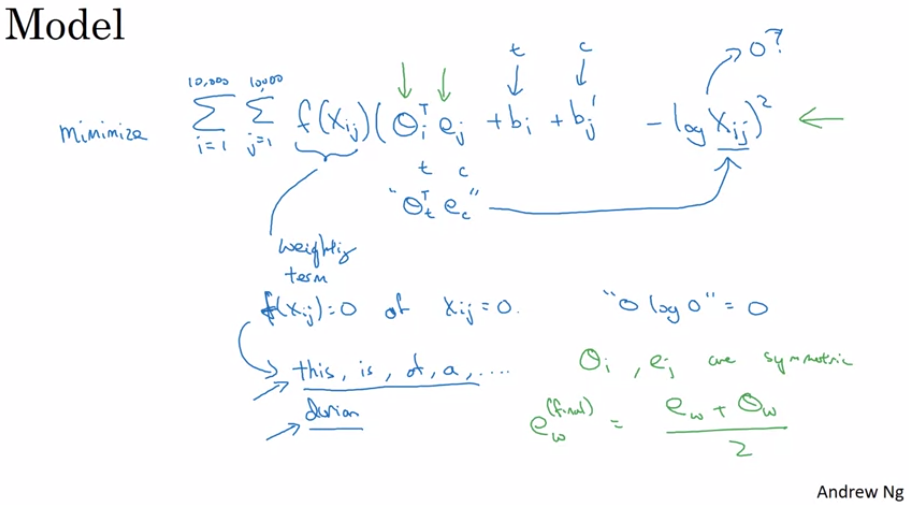

**Note on the featurization view of word embeddings**

The embedding vectors might not be aligned with the feature vectors, and thus the interpretation of the embedding might no be direct.

### 2.3. Application of word embeddings

#### 2.3.1. Simple sentiment classification model

Averaging word embeddings and use a softmax.

Issue: sensitive to word repetition

#### 2.3.2. RNN for sentiment classification

Use a many-to-one RNN with embedding as inputs.

#### 2.3.3. Debiasing word embeddings

How to remove sex, gender, etc. bias?

Basically embeddings will represent the biases that are in the texts from which it learned.

Taking gender bias as an example.

1. Identify bias direction: average (SVD) the difference between gendered vectors
2. For words that is not definitional: project the vectors on the non-bias vectore (ortho to bias vector) to get rid of the bias
3. Equalize pairs: for pair of words only different by gender, make sure they are equally distant from non gender defined words

How to chose 2. words that are not definitional. In the paper, they use a classifier to identify the non definitional words (majority of words).

Similarly for 3., can be handpicked.

## 3. Sequence models & Attention mechanism

### 3.1. Various sequence to sequence architectures

#### 3.1.1. Basic models

* Language translation: one encoding network -> one decoding network generating word sequence
* Image captioning: AlexNet as encoder -> decoding network generating word sequence

One key difference is that we don't want a random generated sequence, but the most likely.

**Picking the most likely sentences**

The generation is conditioned by the input sentence: ~"conditional language model ".

Algorithm needed to find the most likely generated sequence. Greedy search won't work well since picking the most likely word at each step will select more frequent words rather than the best overall translation.

#### 3.1.2. Beam search 

##### 3.1.2.1. Beam search algorithm

*Beam width*: number of probabilities to keep. Balance between result and computation.

**Step 1**

Evaluate all words in vocabulary and keep the B best word as a first word.

**Step 2**

Evaluate all words in vocabulary as second word for each word from previously selected B words, and keep the B best pairs of (word#1, word#2). This results in only B possible choices overall after step 2. 

**Step k**

Process similarly to *Step 2*.

**Stop**

After #iterations or when you have B sentences with <EOS> token.

**N.B.** If B==1 -> same as greedy search.

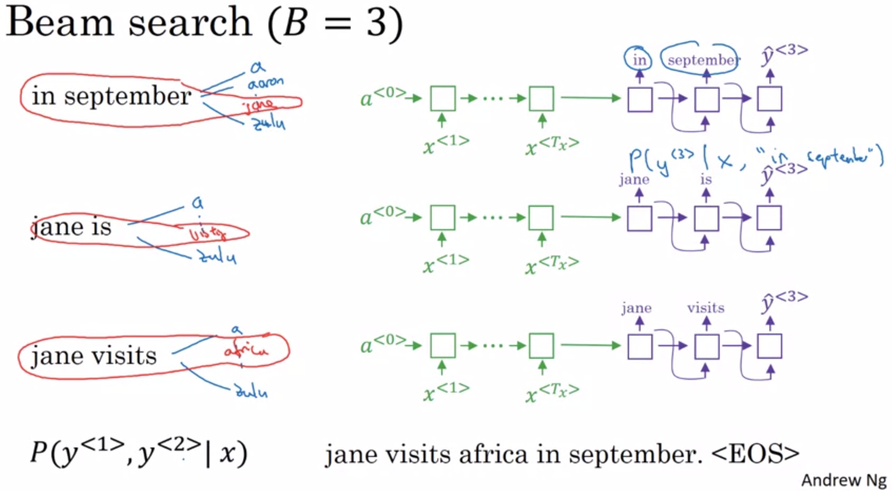

##### 3.1.2.2. Length normalization

When looking for the maximum likelyhood, the algorithm might prefer shorter sentences (product of small probability will -> 0 the more terms there is). One solution is to normalize it by the number of terms (or a softer alternative is T_y^alpha where alpha <1).

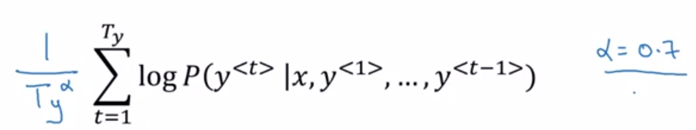

##### 3.1.2.3. Error analysis in beam search

Beam search doesn't always outputs the best solution (heuristic search).

In the translation example we have two algorithms:
* RNN (encoder and decoder)
* Beam search

How to identify from where the errors are coming, and where to spend more time/resources.

Use the *human* translation as input for the RNN decoder and evaluate P(y*|x), and compare it to p(yhat|x).

If the RNN fails to identify the *human* translation as better as the other sentence, RNN==issue, else Beam==issue.

Repeat this process for the sentences in the developer data set, to identify pattern for which the RNN is at fault and others where the Beam search is at fault.

#### 3.1.3. Bleu Score (BiLangual Evaluation Understudy)

Multiple translations can be equally good, how to chose one?

Bleu score: scores a translation output by the model.

**Modified precision**: Number of words from the output appearing in the reference translation (each word can only match once) / total number of words

**Bleu score on bigrams**: Modified precision on bigrams.

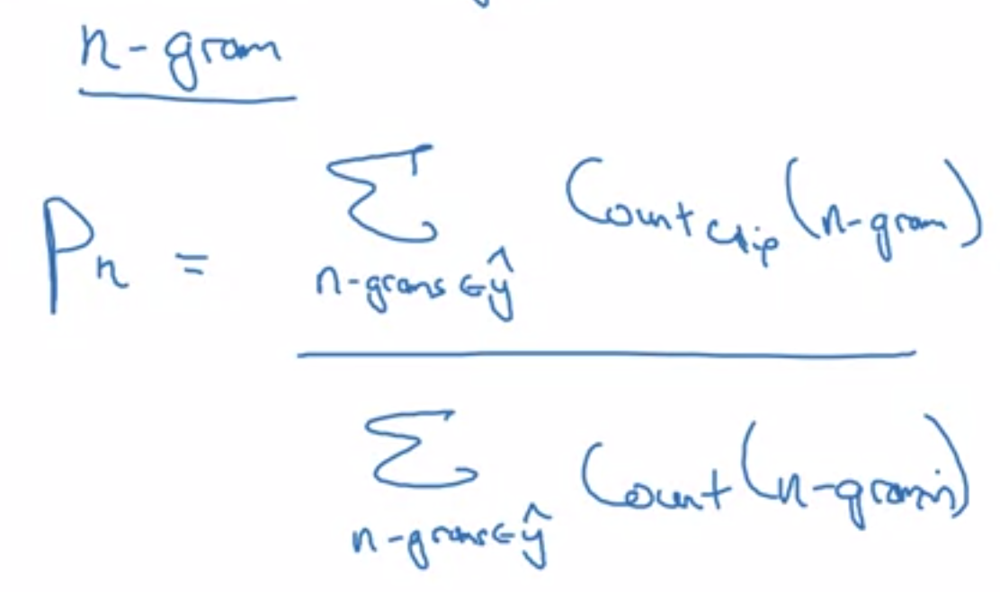

**Complete Blue Score**

* Compute the p_n for each n-grams
* Combined the scores as exponential(average of probabilities) times BP

**BP**: Brewy Penalty, to penalize too short translations.
* Equals to 1 if the outputs length is longer than the reference
* Else, equals to  exponential (1 - reference length/output length).

#### 3.1.4. Attention Model

Define **attention weights**: weigh each word with  on how much attention on it we should have when generating each word.

*Notations*:

}">: both forward and backward activations

Bidirectional RNN fed to a simple forward RNN.

* Attention weights alpha sum to 1: }=1}">
* Context is the weighted sums of activation : }=\sum_{t\prime}{\alpha^{<1,t\prime>}a^{<t\prime>}}">

**Computing attention weights**

Computed through a softmax in addition to a neural network, depending on previous state and activation.

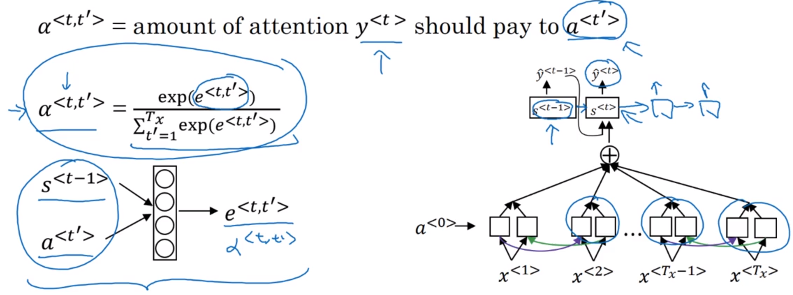

### 3.2. Audio Data

#### 3.2.1. Speech recognition

Common preprocessing: convert to spectrogram (similar to ear processing).

Input length is very large: 10sec at 100Hz = 1000 long, but output my only be a few word.

**Connectionist Temporal Classification: cost for speech recognition**

Collapse repeated characters not separated by blank: "tttt_h_eee____ ____q__" -> "the q"

#### 3.2.2. Trigger Word Detection

Label the training set with 0 everywhere, and 1 during trigger word. To balance a bit more, we can put 1 a bit longer ater the trigger word.
